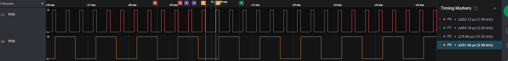
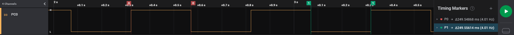
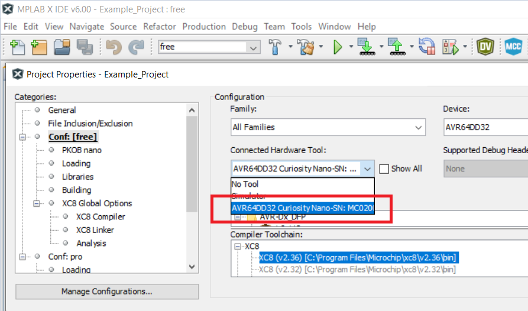

<!-- Please do not change this html logo with link -->

# Timer/Counter Type A (TCA) in Three Different Modes Using the AVR64DD32 Microcontroller Generated with MCC Melody

 The repository contains three MPLAB® X projects:

1.  [Generating a Dual-Slope PWM Signal](#1-generating-a-dual-slope-pwm-signal) - This code example shows how to initialize the Timer/Counter Type A (TCA) in Dual Slope mode to generate a 16-bit Pulse-Width Modulation (PWM) signal with 1 kHz frequency and a 50% duty cycle on a General Purpose Input/Output (GPIO) pin.
      
2.  [Generating Two PWM Signals in Split Mode](#2-generating-two-pwm-signals-in-split-mode) - This code example shows how to initialize the TCA in Split mode to generate two single-slope 8-bit PWM signals on two GPIO pins. The signals will be configured with different frequencies and different duty cycles, as follows: - 1 kHz PWM signal with a 50% duty cycle - 3 kHz PWM signal with a 25% duty cycle
      
3.  [Using Periodic Interrupt Mode](#3-using-periodic-interrupt-mode) - This use case shows how to initialize the TCA in Single mode to work as a counter. The counter overflows every 250 ms and triggers an interrupt, which toggles a pin.

## Related Documentation

More details and code examples on the AVR64DD32 can be found at the following links:

- [AVR64DD32 Product Page](https://www.microchip.com/wwwproducts/en/AVR64DD32)
- [AVR64DD32 Code Examples on GitHub](https://github.com/microchip-pic-avr-examples?q=AVR64DD32)
- [AVR64DD32 Project Examples in START](https://start.atmel.com/#examples/AVR64DD32CuriosityNano)

## Software Used

- [MPLAB® X IDE 6.00 or newer](http://www.microchip.com/mplab/mplab-x-ide)
- [MPLAB® XC8 2.36 or a newer compiler](http://www.microchip.com/mplab/compilers)
- [MPLAB® Code Configurator Melody core 2.1.11 or newer](https://www.microchip.com/en-us/tools-resources/configure/mplab-code-configurator/melody)
- [AVR-Dx Series Device Pack v2.1.152 or newer](https://packs.download.microchip.com)
- Saleae Logic 2.3.47 or newer

## Hardware Used

The AVR64DD32 Curiosity Nano Development Board is used as a test platform.
 

## Operation

Follow the steps provided in the [ How to Program the Curiosity Nano board](#how-to-the-program-curiosity-nano-board) chapter page to program the Curiosity Nano board with this MPLAB® X project.

## 1. Generating a Dual-Slope PWM Signal

This code example shows how to initialize the TCA in Dual Slope mode to generate a 16-bit PWM signal with 1 kHz frequency and 50% duty cycle on a GPIO pin.

## 1.1 Setup

The following configurations must be made for this project:

System clock is 4 MHz

TCA0:

- Clock Selection: System clock/4
- Timer Mode: 16-Bit (Normal)
- 1 kHz Frequency and 50% Duty Cycle
- Waveform Generation Mode: Dual Slope PWM, Overflow on BOTTOM
- Output on Channel 0

| Pin | Configuration  |
| :-: | :------------: |
| PC0 | Digital Output |

## 1.2 Demo

The PWM signal generated by the TCA0 is showed in the image below.

 

The waveform period is approximately 1 kHz and its duty cycle is 50%.

## 1.3 Summary

This code example shows how to initialize the TCA in Dual Slope mode to generate a 16-bit PWM signal with 1 kHz frequency and 50% duty cycle. 
 
[Back to top](#timercounter-type-a-tca-in-three-different-modes-using-the-avr64dd32-microcontroller-generated-with-mcc-melody) 

## 2. Generating Two PWM Signals in Split Mode

This code example shows how to initialize the TCA in Split mode to generate two single-slope 8-bit PWM signals on two GPIO pins. The signals will be configured with different frequencies and different duty cycles, as follows:

- 1 kHz PWM signal with a 50% duty cycle
- 3 kHz PWM signal with a 25% duty cycle

## 2.1 Setup

The following configurations must be made for this project:

System clock is 4 MHz.

TCA0:

- Clock Selection: System clock/16
- Timer Mode: 8-Bit (Split)
- Signal with output on PA0 has a 1 kHz frequency and a 50% Duty Cycle
- Signal with output on PA3 has a 3 kHz frequency and a 25% Duty Cycle
- Output on Channel 0
- Output on Channel 3

| Pin | Configuration  |
| :-: | :------------: |
| PC0 | Digital Output |
| PC3 | Digital Output |

## 2.2 Demo

The PWM signals generated by the TCA0 are showed in the image below.

 

The first waveform period is approximately 1 kHz and its duty cycle is at 50%.
The second waveform period is approximately 3 kHz and its duty cycle is at 25%.

## 2.3 Summary

This code example shows how to initialize the TCA in Split mode to generate two single-slope 8-bit PWM signals on two GPIO pins, with independent duty cycle and frequency. 
 
[Back to top](#timercounter-type-a-tca-in-three-different-modes-using-the-avr64dd32-microcontroller-generated-with-mcc-melody) 

## 3. Using Periodic Interrupt Mode

This use case shows how to initialize the TCA in Single mode to work as a counter. The counter overflows every 250 ms and triggers an interrupt, which toggles a pin.

## 3.1 Setup

The following configurations must be made for this project:

System clock is 4 MHz.

Global Interrupts Enabled

TCA0:

- Clock Selection: System clock/256
- Timer Mode: 16-Bit (Normal)
- Timer Overflows Every 250 ms
- Enable Overflow Interrupt

| Pin | Configuration  |
| :-: | :------------: |
| PC0 | Digital Output |

## 3.2 Demo

The digital value of the PC0 pin toggled by the TCA0 overflow interrupt is showed in the image below.

 

The value of the pin changes every 250 ms.

## 3.3 Summary

This code example shows how to initialize the TCA as a counter to trigger an overflow interrupt every 250 ms, toggling a GPIO in the Interrupt Service Routine (ISR). 
 
[Back to top](#timercounter-type-a-tca-in-three-different-modes-using-the-avr64dd32-microcontroller-generated-with-mcc-melody) 

## How to the Program Curiosity Nano board

This chapter shows how to use the MPLAB® X IDE to program an AVR® device with an Example_Project.X. This can be applied for any other projects.

- Connect the board to the PC.

- Open the Example_Project.X project in MPLAB® X IDE.

- Set the Example_Project.X project as main project.

  - Right click the project in the **Projects** tab and click **Set as Main Project**.
     

- Clean and build the Example_Project.X project.

  - Right click the **Example_Project.X** project and select **Clean and Build**.
     

- Select **AVRxxxxx Curiosity Nano** in the Connected Hardware Tool section of the project settings:

  - Right click the project and click **Properties**.
  - Click the arrow under the Connected Hardware Tool.
  - Select **AVRxxxxx Curiosity Nano** (click the **SN**), click **Apply** and then **OK**:
     

- Program the project to the board.
  - Right click the project and click **Make and Program Device**.
     

 

- [Back to 1. Generating a Dual-Slope PWM Signal](#1-generating-a-dual-slope-pwm-signal)
- [Back to 2. Generating Two PWM Signals in Split Mode](#2-generating-two-pwm-signals-in-split-mode)
- [Back to 3. Using Periodic Interrupt Mode](#3-using-periodic-interrupt-mode)
- [Back to top](#timercounter-type-a-tca-in-three-different-modes-using-the-avr64dd32-microcontroller-generated-with-mcc-melody)
